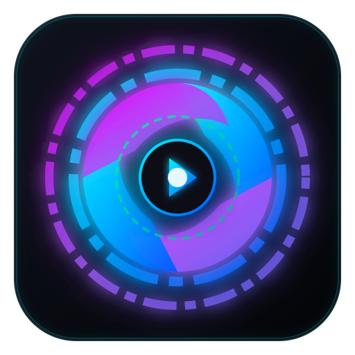

# 🌌 OMYWALL - Universal Wayland Wallpaper Engine



**OMYWALL (`omywall`)** is an ultra-lightweight, hardware-accelerated live video, web stream, and workspace wallpaper engine for Linux Wayland compositors. Built with Rust, `wlr-layer-shell` (`mpvpaper`), `libmpv`, `Ratatui`, and `egui`, it renders high-performance desktop background video and web wallpapers with minimal CPU (~1-3%) and RAM overhead.

> [!NOTE]
> **Maintainer:** MisterNegative ([misternegative21@gmail.com](mailto:misternegative21@gmail.com))

---

## ⚠️ Important Disclaimer & Compatibility

> [!IMPORTANT]
> **OMYWALL is NOT an official Omarchy Linux project.** It is an independent, open-source wallpaper engine built for the broader Linux community.
> 
> **Universal Linux Distribution Support**: `omywall` runs natively on **any Linux distribution** (Arch Linux, Fedora, Ubuntu, Debian, openSUSE, NixOS, Void Linux, Gentoo, Pop!_OS, Manjaro, EndeavourOS, etc.) operating under any `wlr-layer-shell` compatible Wayland compositor, including:
> - **Hyprland**
> - **Sway**
> - **i3 / i3-gaps (Wayland / Sway)**
> - **River**
> - **Niri**
> - **Wayfire**

---

## ✨ Key Features & Capabilities

- 🎥 **Wayland `wlr-layer-shell` Backend**: Video wallpapers attach natively to the desktop `background` layer using `mpvpaper`. Never spawns floating or fullscreen overlay windows above active apps.
- 🗔 **Automatic WM Workspace Sync**: Real-time IPC event listeners for Hyprland, Sway, and i3 sockets. Switching workspaces (`SUPER + 1..10`) automatically transitions wallpaper presets.
- 🖥 **Dual Playback Modes**: Instant toggle between **Workspace Mode** (per-workspace wallpapers) and **Active Screen Mode** (per-monitor output wallpapers).
- 🌐 **Web Streams & Live HTML Widgets**: Stream YouTube/HLS live feeds or overlay interactive HTML5 canvas animations and WebGL widgets directly on your desktop background.
- 🛠 **System Doctor & Diagnostic Center**: Built-in dependency scanner and 1-click multi-distro package installer (`yay`, `paru`, `pacman`, `apt`, `dnf`, `zypper`, `nix`).
- 🎨 **Cyber-Cosmic Graphical UI**: High-tech `egui` desktop control panel with wallpaper hero previews, 1-click workspace matrix, and slideshow controls.
- ⌨️ **Keyboard-Driven Terminal UI**: Fast, lightweight `Ratatui` TUI for CLI aficionados.

---

## ⚙️ Detailed Configuration Guide (`~/.config/omywall/config.toml`)

Configuration is stored in human-readable TOML format at `~/.config/omywall/config.toml`. `omywall` automatically creates and updates this file.

```toml
mode = "workspace" # Active mode: "workspace" or "monitor"
wallpaper_dir = "/home/user/Pictures/Wallpapers"
socket_path = "/run/user/1000/omywall.sock" # Unix IPC Daemon Socket Path
hwdec = "auto" # GPU Acceleration: "auto", "vaapi", "nvdec", "no"
volume = 0 # Audio Volume Level (0-100%)
mute = true # Audio Mute Toggle
screen_id = 0 # Target Monitor Index
opacity = 1.0 # Transparency / Opacity (0.0 to 1.0)
slideshow_interval = 300 # Slideshow rotation interval in seconds
slideshow_shuffle = false # Randomize slideshow order
autostart = false # Autostart background daemon on system boot

# Workspace-to-Wallpaper Mappings (Workspace ID -> File path or Web URL)
[workspace_wallpapers]
"1" = "/home/user/Pictures/Wallpapers/cyberpunk.mkv"
"2" = "https://www.youtube.com/watch?v=5qap5aO4i9A"
"3" = "/home/user/Pictures/Wallpapers/anime_rain.mp4"

# Monitor-to-Wallpaper Mappings (Monitor Output -> File path or Web URL)
[monitor_wallpapers]
"eDP-1" = "/home/user/Pictures/Wallpapers/neon_city.mp4"
"HDMI-A-1" = "https://clock.zone"

# Saved Interactive Web Wallpapers & HTML5 Widgets
[[saved_web_wallpapers]]
title = "Matrix Digital Rain"
url = "assets/web_wallpapers/matrix_rain.html"
category = "Canvas Animation"
is_demo = true

[[saved_web_wallpapers]]
title = "Cyber Neon Clock"
url = "assets/web_wallpapers/cyber_clock.html"
category = "Digital Clock"
is_demo = true
```

---

## 💻 Full Command-Line Interface (CLI) Guide

Launch `omywall --help` or use any of the subcommands below:

| Command | Alias | Description |
| :--- | :--- | :--- |
| `omywall daemon` | `d` | Start background wallpaper engine daemon |
| `omywall gui` | `g` | Launch Graphical Settings & Library GUI |
| `omywall tui` | `t` | Launch Interactive Terminal UI (TUI) |
| `omywall set <file>` | `s` | Set a local video (`.mkv`, `.mp4`, `.gif`, `.webm`) or image as wallpaper |
| `omywall set-url <url>` | `u` | Stream web video URL, YouTube stream, or live HTML page |
| `omywall set-workspace <ws> <file>` | `set-ws` | Assign wallpaper to a specific workspace (e.g. `1`, `2`) |
| `omywall switch-workspace <ws>` | `switch-ws` | Switch active wallpaper to workspace mapping |
| `omywall set-monitor <mon> <file>` | `mon` | Assign wallpaper to a specific monitor output (`eDP-1`, `HDMI-A-1`) |
| `omywall mode [workspace\|screen\|toggle]` | `m` | Toggle between **Workspace Mode** and **Active Screen Mode** |
| `omywall cycle` | `live`, `toggle-live` | Cycle live video wallpapers sequentially & toggle playback |
| `omywall clear` | `c` | Stop wallpaper playback and clear background |
| `omywall pause` | - | Pause video wallpaper playback |
| `omywall resume` | `r` | Resume video wallpaper playback |
| `omywall toggle` | `p`, `tog` | Toggle pause / play |
| `omywall next` | `n` | Play next wallpaper in directory |
| `omywall prev` | `b` | Play previous wallpaper in directory |
| `omywall slideshow` | - | Start automated slideshow rotation |
| `omywall stop-slideshow` | - | Stop automated slideshow rotation |
| `omywall set-opacity <0.0-1.0>` | - | Set wallpaper transparency / opacity level |
| `omywall set-volume <0-100>` | - | Set audio playback volume |
| `omywall autostart [--enable\|--disable]` | - | Toggle system desktop autostart on boot |
| `omywall status` | `st` | Query daemon status & active playback info |
| `omywall stop` | `k` | Stop background daemon |
| `omywall logs` | `l` | View daemon diagnostic log file |

---

## ⌨️ Terminal UI (TUI) Keybindings

Launch via `omywall tui`:

| Key | Action |
| :--- | :--- |
| `Enter` | Apply selected wallpaper |
| `t` / `Tab` | Toggle Mode (**Workspace Mode** ↔ **Active Screen Mode**) |
| `c` | Cycle live wallpapers sequentially |
| `w` | Open prompt to map selected wallpaper to Workspace (1-10) |
| `M` | Open prompt to map selected wallpaper to Monitor output |
| `/` | Filter wallpaper library by search |
| `p` | Toggle Pause / Resume playback |
| `s` | Toggle Auto-Slideshow mode |
| `[` / `]` | Decrease / Increase opacity transparency |
| `+` / `-` | Increase / Decrease audio volume |
| `m` | Toggle Audio Mute |
| `r` | Rescan wallpaper directory |
| `q` / `Esc` | Exit TUI |

---

## 🛠 Prerequisites & Installation

### Essential Dependencies
- `mpvpaper` (Primary Wayland `wlr-layer-shell` video wallpaper engine)
- `mpv` (Hardware-accelerated video player backend)
- `ffmpeg` (Video thumbnailing & media processing)
- `libnotify` / `notify-send` (Desktop notifications)

### Build & Install from Source
```bash
# Clone the repository
git clone https://github.com/misternegative21/omywall.git
cd omywall

# Run installation script (builds binary and installs desktop icons)
bash install.sh
```

---

## 🖥 Window Manager Autostart Configuration

### Hyprland (`~/.config/hypr/hyprland.conf`)
```ini
# Start OMYWALL Daemon on boot
exec-once = omywall daemon

# Keybindings for workspace switching (auto-detected by OMYWALL IPC socket)
bind = SUPER, 1, workspace, 1
bind = SUPER, 2, workspace, 2
bind = SUPER, 3, workspace, 3
```

### Sway / i3 (`~/.config/sway/config`)
```ini
# Start OMYWALL Daemon on boot
exec omywall daemon
```

---

## 🙏 Credits & Acknowledgments

`OMYWALL` stands on the shoulders of these incredible open-source projects:

- **[mpvpaper](https://github.com/GhostKey/mpvpaper)** by GhostKey / Alex-D — The core Wayland `wlr-layer-shell` video wallpaper renderer.
- **[mpv](https://mpv.io/)** — Powerful hardware-accelerated media player engine.
- **[FFmpeg](https://ffmpeg.org/)** — Industry-standard multimedia framework for thumbnailing and decoding.
- **[Ratatui](https://ratatui.rs/)** — Terminal UI framework for Rust.
- **[egui / eframe](https://github.com/emilk/egui)** — Immediate mode GUI framework for Rust.
- **[Hyprland](https://hyprland.org/)** & **[Sway](https://swaywm.org/)** — Modern Wayland compositors.

---

## 📄 License

MIT License. Maintained by **MisterNegative** ([misternegative21@gmail.com](mailto:misternegative21@gmail.com)).
