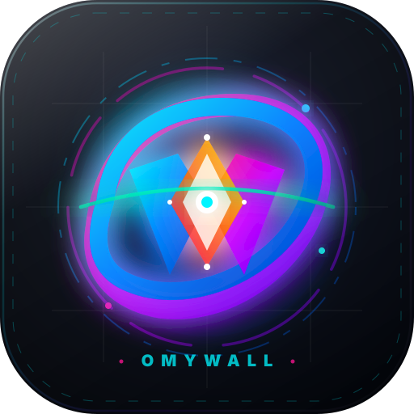

# 🌌 OMYWALL - Universal Wayland Wallpaper Engine

<div align="center">
  

  ### Ultra-Lightweight, Hardware-Accelerated Video, Web 3D & Desktop Wallpaper Engine for Linux Wayland

  [](https://opensource.org/licenses/MIT)
  [](https://aur.archlinux.org/)
  [](https://wayland.freedesktop.org/)
  [](https://www.rust-lang.org/)
  [](https://www.nvidia.com/)
</div>

---

## 📖 About

**OMYWALL (`omywall`)** is an ultra-lightweight, hardware-accelerated live video, web stream, and desktop wallpaper engine for Linux Wayland compositors. Built with Rust, native `wlr-layer-shell` (`mpvpaper` & `GTK Layer Shell` + `WebKit2`), `libmpv`, `Ratatui`, and `egui`, it renders high-performance desktop background videos and live WebGL 3D wallpapers natively behind all windows on every workspace with minimal CPU (~1-2%) and RAM overhead.

---

## ✨ Key Features & Capabilities

- 🎥 **Wayland `wlr-layer-shell` Video Engine**: Video wallpapers (`.mp4`, `.mkv`, `.webm`, `.gif`) attach natively to the desktop `background` layer using `mpvpaper`. Never spawns floating or fullscreen overlay windows above active apps.
- 💚 **NVIDIA PRIME / CUDA Hardware Acceleration**: Automatic GPU offload (`__NV_PRIME_RENDER_OFFLOAD=1`, `nvdec`, `cuda`) for 4K 60FPS video playback and WebGL 3D rendering directly on discrete NVIDIA GPUs.
- 🌐 **Native In-App WebGL & Web Preview Engine**: High-performance multi-tier offscreen rendering engine (WebKit2GTK + Electron snapshotter + headless Chromium fallback) with live hover animations for WebGL 3D scenes and URLs.
- 📱 **Glassmorphic Desktop Widgets Suite**: Native live desktop widgets (System Monitor, WiFi/Network stats, Bluetooth devices, Battery telemetry, Cyberpunk HUD, and Minimal Clock) rendered on Wayland `top`/`overlay` layers with IPC control.
- 🕹️ **Steam Workshop Browser**: Full interactive Steam Workshop catalog browser with keyword search, tags filtering, popularity/trending sorting, and 1-click `steamcmd` asset downloads.
- 🩺 **System Doctor & Live Logs**: Real-time diagnostic checklist for compositor (`Hyprland`/`Sway`/`Wayfire`), GPU decoders, audio servers (`PipeWire`), and toolchains with 1-click clipboard diagnostics and live daemon log inspection.
- 🖤 **OLED Interactive Wallpapers**: Specially crafted pitch-black `#000000` canvas wallpapers with interactive liquid fluid mouse-following particle physics.
- 🔒 **Hyprlock Screensaver Integration**: Attach any video, image, or Web 3D wallpaper directly as your `hyprlock` screensaver background with auto-extracted frame thumbnails and blur controls.
- ⚡ **ANR-Free Non-Blocking Architecture**: All Unix socket IPC network requests and daemon polling run on isolated background threads, guaranteeing the UI event loop never freezes or triggers OS "Application Not Responding" warnings.
- 🎨 **Modern Cyberpunk egui Desktop GUI**: High-tech desktop control panel with live hero previews, media inspector, multi-monitor configuration, and hardware decoder selector.
- ⌨️ **Keyboard-Driven Terminal UI (`Ratatui`)**: Fast, lightweight TUI for terminal aficionados with rounded neon borders and instant keybindings.

---

## 📦 Installation Guide

### 🔷 Arch Linux (AUR)
```bash
# Install via AUR helper (yay / paru)
yay -S omywall-git

# Or build manually with makepkg
git clone https://github.com/MISTERNEGATIVE21/omywall.git
cd omywall
makepkg -si
```

### ⚡ Quick Install Script (Any Linux Distribution)
```bash
git clone https://github.com/MISTERNEGATIVE21/omywall.git
cd omywall
bash install.sh
```

---

## 🎮 Usage & Commands

### 🖥 Launching Interfaces
```bash
# Launch Graphical Desktop GUI
omywall gui

# Launch Interactive Terminal UI (TUI)
omywall tui

# Start background wallpaper daemon
omywall daemon
```

### 🚀 CLI Quick Commands
```bash
# Set a video or HTML wallpaper
omywall set ~/Pictures/Wallpapers/cyberpunk_city.mp4
omywall set assets/web_wallpapers/neon_oled_fluid_mouse_3d.html

# Stream a web URL
omywall set-url "https://html5test.com"

# Playback controls
omywall pause
omywall resume
omywall toggle
omywall hide         # Hide/pause wallpaper engine & GUI when idle (hypridle)
omywall show         # Restore/resume wallpaper engine when returning from idle
omywall toggle-hide  # Toggle hide/visible state
omywall minimize     # Minimize GUI window and pause playback
omywall clear

# Waybar & Hypridle integration setup
omywall waybar             # Output JSON status formatted for Waybar custom module
omywall hypridle-config    # Print recommended hypridle.conf snippet
omywall waybar-config      # Print recommended Waybar config.jsonc & style.css

# Enable automated slideshow (300 seconds interval)
omywall slideshow --interval 300 --shuffle
```

---

## 🔒 Hypridle & 📊 Waybar Integration

### 🔒 Hypridle (`~/.config/hypr/hypridle.conf`)
Automatically pause and hide the wallpaper engine when your system goes idle to save 100% CPU and GPU resources:
```ini
listener {
    timeout = 300                                # 5 minutes idle
    on-timeout = omywall hide                   # Pause & hide wallpaper engine
    on-resume = omywall show                    # Restore & resume wallpaper playback
}
```

### 📊 Waybar (`~/.config/waybar/config.jsonc`)
Add interactive wallpaper status widget to Waybar:
```json
"custom/omywall": {
    "format": "{}",
    "return-type": "json",
    "exec": "omywall waybar",
    "interval": 2,
    "on-click": "omywall toggle",
    "on-click-right": "omywall toggle-hide",
    "on-click-middle": "omywall minimize",
    "on-scroll-up": "omywall next",
    "on-scroll-down": "omywall prev"
}
```

---

## ⚙️ Configuration (`~/.config/omywall/config.toml`)

```toml
wallpaper_dir = "/home/user/Pictures/Wallpapers"
socket_path = "/run/user/1000/omywall.sock"
hwdec = "auto" # Hardware Decoder: "auto", "nvdec", "cuda", "vaapi", "vulkan", "no"
volume = 0
mute = true
screen_id = 0
target_fps = 60
opacity = 1.0
slideshow_interval = 300
slideshow_shuffle = false

[hyprlock]
enabled = true
background_path = ""
blur_passes = 3
blur_size = 8
clock_color = "rgba(0, 240, 255, 1.0)"
clock_size = 64
welcome_message = "Welcome back, $USER"
```

---

## 📜 License
Licensed under the [MIT License](LICENSE). Built with ❤️ for Linux Wayland users.
